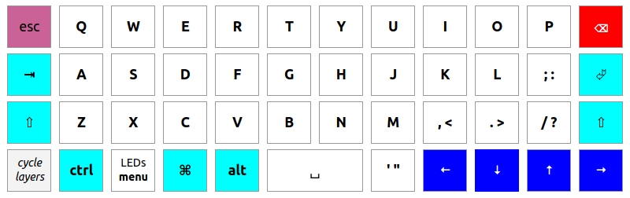
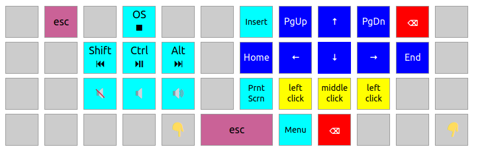
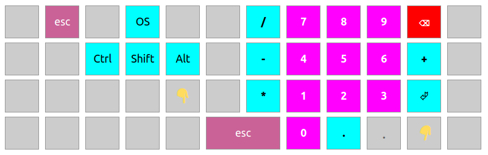
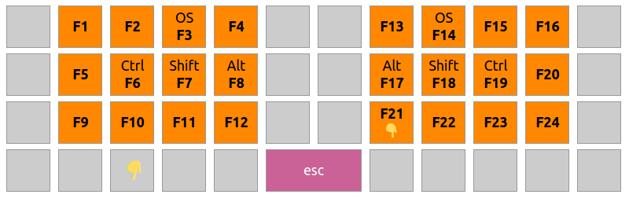
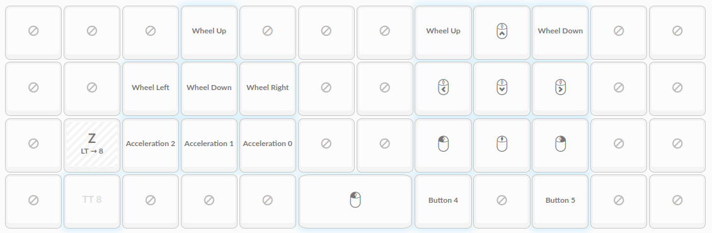
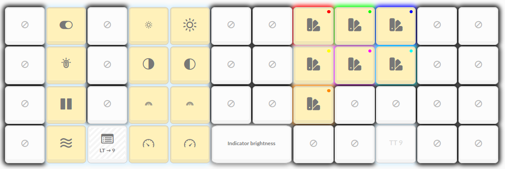
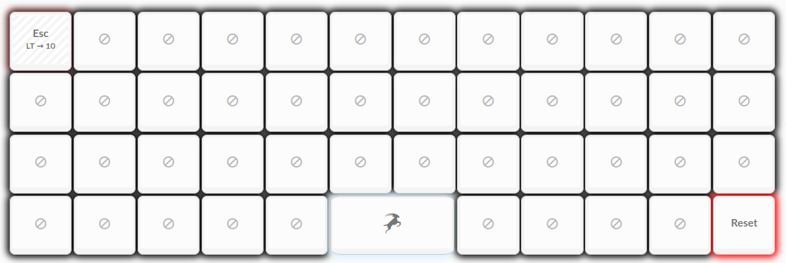

# keyboard <!-- omit in TOC -->

## Table of contents <!-- omit in TOC -->

- [Summary](#summary)
- [Layouts](#layouts)
	- [t00mietum Comfort](#t00mietum-comfort)
	- [t00mietum QWERTY](#t00mietum-qwerty)
- [ROMs](#roms)
	- [Ergodox Planck EZ Glow](#ergodox-planck-ez-glow)
	- [ZSA Moonlander Mark I](#zsa-moonlander-mark-i)

## Summary

"t00mietum comfort" is a bottom-up ergonomic redesign keyboard layout for QMK programmable keyboards. There were no sacred cows - not modifiers, not symbols ... only statistically validaded and human-tested comfort.

## Layouts

The detailed design is available [here](https://docs.google.com/spreadsheets/d/1i8QfbnC41kJ8Fhe2n4VAXiONWaPQjeGDeqqHqsaXD2Y/edit?usp=sharing) (Google Sheets).

These layouts are designed to be fully functional even on minimalist split keebs with only 30 main keys and three thumb keys per side. (Like the ["Microdox"](https://raw.githubusercontent.com/t00mietum/keyboard/main/images/microdox.jpg) from [boardsource.xyz](https://boardsource.xyz/store/5f2e7e4a2902de7151494f92).)

However, each specific ROM available here has been carefully designed so that all availible keys are maximized - usually in a way that eases the transition from the standard legacy keyboard layout. (For example, the left and rightmost colums on ZSA keyboards, redundantly emulate the similar positions on legacy keyboards.)

### t00mietum Comfort

This layout is optimized to minimize use of pinkies, and index finger stretching; and maximize speed and accuracy. (Recognizing that optimizing all parameters isn't possible.)

### t00mietum QWERTY

This layout is optimized to minimize use of pinkies, and index finger stretching, while still being QWERTY. The outermost columns are optional, transitional, and should be minimized (otherwise this layout probably wouldn't worth the effort to adjust to).

### basic QWERTY/gaming

### Navigation & media control

### Programming/symbols

### Numpad

Even if you've never been a cashier or accountant before, the numpad layout is super-easy to learn and vastly superior to a top-row 1 - 0 layout, even just for a random digit here or there.

### Function keys

### Mouse emulation

### LED control

### Oryx/flash

## ROMs

### Ergodox Planck EZ Glow

E.g. ZSA, e.g. Planck Nano.

- Company [produce page](https://ergodox-ez.com/pages/planck)
- Download [t00mietum ROM](https://github.com/t00mietum/keyboard/raw/main/keeb%20-%20ergodox%20planck%20ez%20glow/planck_ez_glow_t00mietum-comfort.bin)
- Forkable Oryx [configuration](https://configure.ergodox-ez.com/planck-ez/layouts/En5W5/)

### ZSA Moonlander Mark I

- Company [produce page](https://www.zsa.io/moonlander/)
- Download [t00mietum ROM](https://github.com/t00mietum/keyboard/raw/main/keeb%20-%20zsa%20moonlander/moonlander_t00mietum-comfort.bin)
- Forkable Oryx [configuration](https://configure.ergodox-ez.com/moonlander/layouts/7Qqby/)
