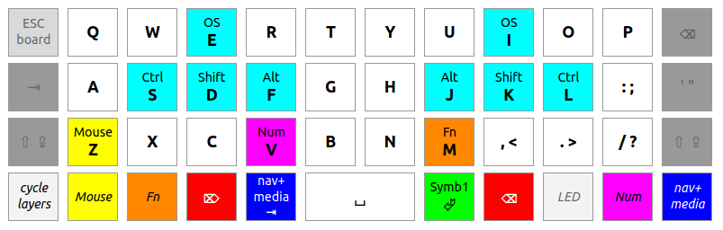

<!-- omit in TOC -->
# keyboard

<!-- omit in TOC -->
## Table of contents
- [keyboard](#keyboard)

## Summary

Ground-up redesign of ergonomic keyboard layout for QMK programmable keyboards. There are no sacred cows - not modifiers, not symbols ... only statistically validaded and human-tested comfort.

## Layouts

### ZSA Nano EZ Glow

### t00mie Comfort

This layout is optimized to minimize use of pinkies, and index finger stretching; and maximize speed and accuracy. (Recognizing that optimizing all parameters isn't possible.)

#### t00mie QWERTY

This layout is optimized to minimize use of pinkies, and index finger stretching, while still being QWERTY. The outermost columns are optional, transitional, and should be minimized (otherwise this layout isn't worth the effort).

